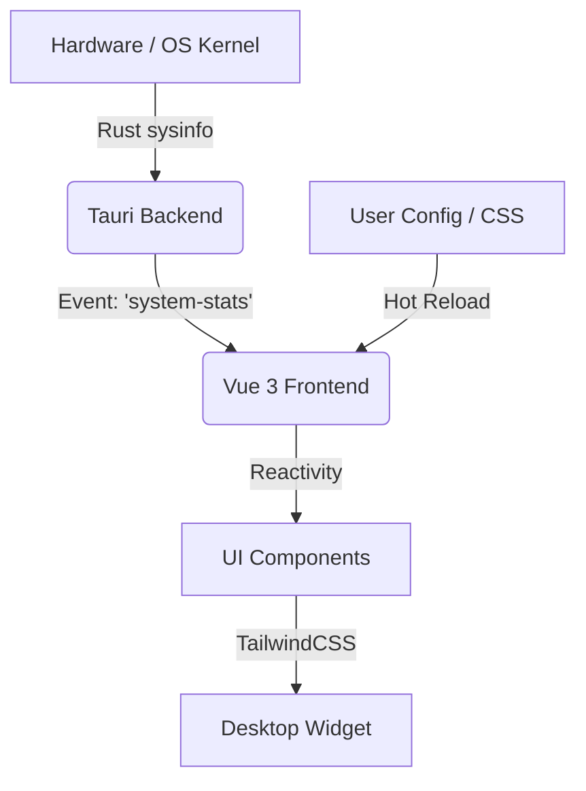

# Vitals ⚡️

<p align="center">
  
</p>

<p align="center">
  <strong>The Pulse of Your System.</strong><br>
  一个基于 Tauri 重写的现代全平台桌面系统监控工具。
</p>

<p align="center">
  
  
  
  
  
</p>

---

## 📖 简介 (Introduction)

**Vitals** 是对经典工具 [Conky](https://github.com/brndnmtthws/conky) 的一次现代致敬与重构。

传统的 Conky 强大但配置复杂（Lua/配置语法），且 UI 渲染受限。Vitals 利用 **Rust** 的高性能系统级监控能力，结合 **Web 技术 (HTML/CSS)** 的无限渲染可能，为你提供一个既极客又美观的“桌面伴侣”。

它不仅仅是展示数据，它是你桌面上跳动的脉搏。

## ✨ 功能特性 (Features)

### 🖥 核心监控 (Core Metrics)
*   **CPU**: 实时显示每个核心的负载、频率及温度监控。
*   **Memory**: RAM 与 Swap 的动态使用情况，支持可视化进度条。
*   **GPU**: 自动检测 NVIDIA/AMD 显卡，显示显存占用、核心频率及温度。
*   **Storage**: 硬盘读写速度 (I/O) 及各分区剩余空间。
*   **Network**: 实时上传/下载网速波形图，支持多网卡切换。

### 🚀 进阶功能 (Advanced)
*   **进程透视**: 实时 Top 进程列表。*亮点功能：支持直接点击杀掉卡死的进程 (Kill Process)。*
*   **桌面锚定 (Pin to Desktop)**: 
    *   利用 Tauri 窗口特性，完美嵌入桌面壁纸层之上。
    *   支持“穿透模式” (Click-through)，不影响你点击桌面图标。
*   **Docker 容器监控**: (可选) 实时查看运行中的容器及其资源占用。
*   **笔记本友好**: 电池健康度与充放电功率显示。

### 🎨 极致定制 (Customization)
*   **CSS-First**: 忘掉复杂的配置文件。想改布局？用 Flexbox/Grid。想改颜色？写 CSS。
*   **主题系统**: 内置类似 Slack 的侧边栏配色逻辑，支持一键切换 `Cyberpunk`, `Dracula`, `Nord` 等经典主题。
*   **热重载**: 修改配置或 CSS，界面即时更新，无需重启应用。

## 🛠 技术架构 (Architecture)

Vitals 采用前后端分离的架构，充分利用 Tauri 2.0 的安全与性能特性：

*   **Backend (Rust)**: 
    *   使用 `sysinfo` 和 `nvml-wrapper` 等库直接读取底层硬件数据，开销极低。
    *   通过 Tauri Event Channel 向前端高频推送数据。
*   **Frontend (Web)**:
    *   **Vue 3**: 响应式数据绑定，丝滑的 UI 更新。
    *   **TypeScript**: 类型安全，保证代码健壮性。
    *   **TailwindCSS**: 快速构建布局，支持原子化样式定制。
    *   **PrimeVue**: Next Generation Vue UI Component Library.
    *   **ECharts / Chart.js**: 渲染精美的实时波形图。



## 📸 预览 (Screenshots)

*(此处预留位置：后续开发完成后，可以放一张透明背景、悬浮在漂亮壁纸上的截图)*

## 🚀 快速开始 (Getting Started)

### 环境要求
*   Linux (X11 或 Wayland) *注: Wayland 下部分窗口层级功能可能受限*
*   Rust & Cargo
*   Node.js & pnpm

### 安装与运行

```bash
# 1. 克隆项目
git clone https://github.com/yourname/vitals.git
cd vitals

# 2. 安装依赖
pnpm install

# 3. 开发模式运行 (Hot Reload)
pnpm tauri dev
```

### 构建发布

```bash
pnpm tauri build
```

## 🗺 路线图 (Roadmap)

- [ ] **v0.1**: 基础 CPU/内存/网络显示
- [ ] **v0.2**: 实现 窗口置底 (Desktop Widget) 和鼠标穿透。
- [ ] **v0.3**: 加入 GPU 和 进程管理功能。
- [ ] **v0.4**: 推出“主题商店”功能，允许导入社区 CSS 主题。
- [ ] **v1.0**: 插件系统，支持编写简单的 JS 脚本获取自定义数据 (如天气、股票、GitHub Stars)。

## 🤝 贡献 (Contributing)

欢迎提交 PR！无论是优化 Rust 后端的资源占用，还是设计一款超酷的 CSS 主题。

## 📄 许可证 (License)

MIT License

---

<p align="center">Made with ❤️ using Tauri & Vue</p>